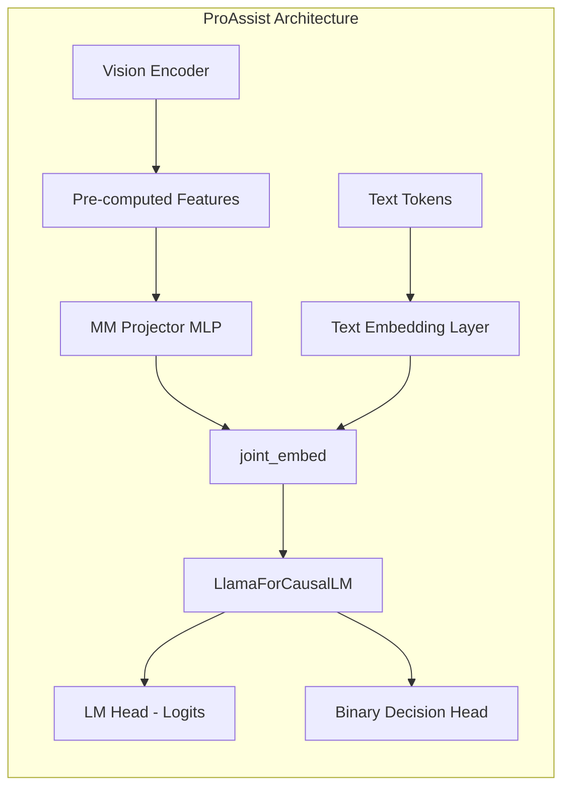
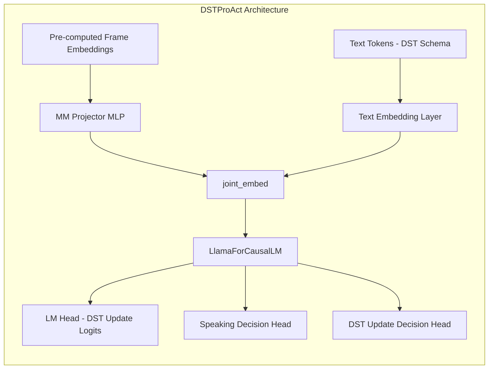

# Plan: ProAssist-Style Model Extension for DST

## Goal
Create a custom model architecture that follows ProAssist's proven design pattern, giving us full control over how vision features are integrated with the language model. This approach avoids the hacks required when using the standard `SmolVLMForConditionalGeneration` and enables a clean comparison with the original ProAssist work.

## ProAssist Architecture Overview

Based on analysis of `mmassist/model/modeling_proact.py`:



**Key Components:**
1.  **Vision Encoder:** Separate (often frozen) encoder (SigLIP/CLIP) that extracts features. **Pre-computed offline for efficiency.**
2.  **MM Projector:** 2-layer MLP that projects vision features to LLM embedding space.
3.  **`joint_embed()`:** Fuses text embeddings with projected image embeddings by replacing `<image>` tokens.
4.  **Base LLM:** `LlamaForCausalLM` (text-only) used as the backbone.
5.  **Binary Decision Head:** Predicts "When to Talk" (W2T) from hidden states.

---

## Proposed Architecture: `DSTProActLlamaForCausalLM`

We will create a new model class that mirrors ProAssist's structure but is adapted for the DST task.



**Changes from ProAssist:**
1.  **Two Binary Heads:** `speaking_decision_head` (should assistant speak?) and `dst_update_head` (should we update the DST?).
2.  **DST-Specific Prompting:** The text input will be the DST schema and conversation history, not just a summary.
3.  **Output Generation:** When `dst_update_head` fires, the model generates the specific DST update (e.g., `step_id=5, transition=DONE`).

---

## Implementation Plan

### Phase 1: Configuration

#### [NEW] `custom/src/prospect/models/configuration_dst_proact.py`

Create a config class that extends `LlamaConfig` with DST-specific settings.

```python
from transformers import LlamaConfig, PretrainedConfig

class DSTProActConfig(LlamaConfig, PretrainedConfig):
    def __init__(
        self,
        *,
        llm_pretrained: str = "meta-llama/Meta-Llama-3.1-8B-Instruct",
        vision_hidden_size: int = 2048,  # Match your pre-computed embeddings
        max_seq_len: int = 4096,
        img_token: str = "<image>",
        use_speaking_decision_head: bool = True,
        use_dst_update_head: bool = True,
        binary_loss_weight: float = 1.0,
        exceed_context_handling: str = "drop_all",
        **kwargs,
    ):
        # ... (merge LlamaConfig with custom settings)
```

---

### Phase 2: Model Class

#### [NEW] `custom/src/prospect/models/dst_proact_llama.py`

Create the main model class following ProAssist's mixin pattern.

```python
from transformers import LlamaForCausalLM
import torch.nn as nn

class DSTProActModelMixin:
    """Mixin that adds multimodal and DST capabilities."""
    
    def _init_multimodal_modules(self, mm_feature_size, lm_input_size):
        # MM Projector (2-layer MLP)
        self.mm_projector = nn.Sequential(
            nn.Linear(mm_feature_size, lm_input_size, bias=True),
            nn.GELU(),
            nn.Linear(lm_input_size, lm_input_size, bias=True),
        )
        
        # Binary Decision Heads
        self.speaking_decision_head = nn.Linear(lm_input_size, 1)
        self.dst_update_head = nn.Linear(lm_input_size, 1)
    
    def mm_feature_proj(self, features: torch.Tensor) -> torch.Tensor:
        """Project vision features to LLM embedding space."""
        return self.mm_projector(features)
    
    def joint_embed(self, input_ids, image_embeds=None):
        """Fuse text tokens with projected image embeddings."""
        inputs_embeds = self.get_input_embeddings()(input_ids)
        if image_embeds is not None:
            projected = self.mm_feature_proj(image_embeds)
            # Replace <image> tokens with projected embeddings
            inputs_embeds[input_ids == self.config.img_token_id] = projected
        return inputs_embeds
    
    def fast_greedy_generate(self, inputs_embeds, past_key_values, max_length=100, **kwargs):
        """Token-by-token generation with KV cache (ProAssist pattern)."""
        # ... (copy from ProAssist, adapted for DST heads)


class DSTProActLlamaForCausalLM(LlamaForCausalLM, DSTProActModelMixin):
    """DST-extended Llama with multimodal support."""
    config_class = DSTProActConfig
    
    def __init__(self, config: DSTProActConfig):
        super().__init__(config)
        # Initialize multimodal modules after base Llama
    
    def forward(
        self,
        input_ids=None,
        image_embeds=None,
        past_key_values=None,
        attention_mask=None,
        labels=None,
        **kwargs,
    ):
        # 1. Fuse embeddings
        inputs_embeds = self.joint_embed(input_ids, image_embeds)
        
        # 2. Call base Llama forward
        outputs = super().forward(
            inputs_embeds=inputs_embeds,
            past_key_values=past_key_values,
            attention_mask=attention_mask,
            output_hidden_states=True,
            **kwargs,
        )
        
        # 3. Compute binary head outputs from last hidden state
        last_hidden = outputs.hidden_states[-1]
        outputs.speaking_logits = self.speaking_decision_head(last_hidden)
        outputs.dst_update_logits = self.dst_update_head(last_hidden)
        
        # 4. Compute losses if labels provided (training)
        # ... (similar to ProAssist's loss computation)
        
        return outputs
```

---

### Phase 3: Inference Runner

#### [MODIFY] `custom/src/prospect/inference/dst_stream_runner.py`

Update the runner to work with `DSTProActLlamaForCausalLM` instead of `DSTSmolVLMWithStrategies`.

**Key Changes:**
-   Use `joint_embed()` to create fused embeddings.
-   Use `fast_greedy_generate()` for token-by-token generation.
-   Check `speaking_logits` and `dst_update_logits` from outputs.

---

### Phase 4: Training

#### [MODIFY] `custom/src/prospect/training/dst_custom_trainer.py`

Update the trainer to handle the new model's loss signature.

**Key Changes:**
-   The model's `forward()` will now return losses for `speaking_decision_head` and `dst_update_head`.
-   Log these losses separately for monitoring.

---

### Phase 5: Pre-computing Embeddings with ProAssist's Vision Encoder

ProAssist uses a **SigLIP** (or CLIP) vision encoder to extract frame embeddings. This is much faster than SmolVLM's encoder and produces a single embedding per image (CLS token).

#### ProAssist Vision Encoder Configuration

From `mmassist/model/configuration_proact.py`:

| Config Key             | Default                            | Description                                |
| ---------------------- | ---------------------------------- | ------------------------------------------ |
| `vision_pretrained`    | `google/siglip-so400m-patch14-384` | Vision encoder model                       |
| `use_img_cls_token`    | `True`                             | Use CLS token (1 embedding per image)      |
| `img_patch_token_size` | `0`                                | Patch grid size (0 = no patches, just CLS) |
| `vision_hidden_size`   | `1152`                             | Output embedding dimension                 |

#### Extracting Embeddings

Use the ProAssist `VisualEncoder` class directly:

```python
import torch
from mmassist.model.vision import VisualEncoder
from mmassist.model.configuration_proact import ProActConfig

# Create config
config = ProActConfig(
    vision_pretrained="google/siglip-so400m-patch14-384",
    use_img_cls_token=True,
    img_patch_token_size=0,  # CLS token only
)

# Initialize encoder
encoder = VisualEncoder.from_config(config)
encoder = encoder.to("cuda").eval()

# Encode frames (N, 3, H, W) -> (N, 1, 1152)
with torch.no_grad():
    frames = torch.randn(10, 3, 384, 384).cuda()  # Example batch
    embeddings = encoder.encode(frames)
    print(embeddings.shape)  # [10, 1, 1152]
```

#### ProAssist's Actual Embedding Extraction Script

ProAssist uses [`mmassist/datasets/preprocess/encode_frames.py`](file:///u/siddique-d1/adib/ProAssist/mmassist/datasets/preprocess/encode_frames.py) to extract embeddings from Arrow files.

**How it works:**
1. Reads frames from Arrow files using `datasets.load_dataset("arrow", ...)`
2. Decodes base64 images using `img_base64_to_tensor()`
3. Encodes batches using `VisualEncoder.encode()`
4. Saves CLS token + pooled patch features back to Arrow files

#### CLS-Only Extraction (Faster)

For DST, we only need the CLS token. Modify `encode_frames.py` lines 69-72 to skip patch pooling:

```diff
                    batch_feats = {"cls": batch_cls_feats.cpu().half()}
-                   for p in patch_sizes:
-                       patch_feats = adaptive_avg_pool2d(batch_patch_feats, (p, p))
-                       batch_feats[f"{p}x{p}"] = patch_feats.cpu().half()
+                   # Skip patch pooling for DST (CLS-only)
```

Or simply ignore the `--extract_patch_layouts` argument impact by passing `--extract_patch_layouts 0`:

```bash
python mmassist/datasets/preprocess/encode_frames.py \
    --preprocessed_frames_dir /path/to/frames \
    --output_dir /path/to/features \
    --vision_pretrained google/siglip-so400m-patch14-384 \
    --extract_patch_layouts 0 \
    --batch_size 256
```

> [!NOTE]
> Passing `0` as patch layout will create a `0x0` key with empty tensor, but CLS is always computed.
> You can filter to only use the `cls` key when loading.

**Key Arguments:**

| Argument                    | Default                            | Description                                               |
| --------------------------- | ---------------------------------- | --------------------------------------------------------- |
| `--preprocessed_frames_dir` | -                                  | Directory containing `<video_id>.arrow` files with frames |
| `--output_dir`              | -                                  | Output directory for features                             |
| `--vision_pretrained`       | `google/siglip-so400m-patch14-384` | Vision encoder model                                      |
| `--extract_patch_layouts`   | `2,3,5`                            | Patch grid sizes (use `0` to skip)                        |
| `--batch_size`              | `256`                              | Batch size for encoding                                   |

**Output Format (CLS-only):**
- `cls`: CLS token embedding `[1, 1152]`

#### Key Differences from SmolVLM Embeddings

| Aspect            | SmolVLM Encoder  | SigLIP (ProAssist) |
| ----------------- | ---------------- | ------------------ |
| **Model Size**    | ~2B params       | ~400M params       |
| **Speed**         | Slow             | **4-5x faster**    |
| **Output**        | 81+ patch tokens | **1 CLS token**    |
| **Dim**           | 2048             | **1152**           |
| **Compatibility** | Requires hacks   | **Native support** |

> [!TIP]
> **Use SigLIP embeddings for the ProAssist-style architecture.**  
> They are faster to extract and directly compatible with the `mm_projector`.

---

### Phase 6: Pre-computed Embeddings Integration

Your existing pre-computed embeddings (CLS token, 1 per image) are compatible with this architecture. The `mm_projector` will project them from your embedding dimension (e.g., 1152) to the LLM's hidden size (e.g., 4096 for Llama-3).

> [!IMPORTANT]
> **Ensure your embedding dimension matches `config.vision_hidden_size`.**
> If you extracted SigLIP CLS tokens, `vision_hidden_size` should be 1152 (SigLIP-384) or 1024 (SigLIP-256).

---

## Migration Steps

1.  **Create Config:** `configuration_dst_proact.py`
2.  **Create Model:** `dst_proact_llama.py` (following ProAssist patterns)
3.  **Update Runner:** Point to new model class.
4.  **Update Trainer:** Handle new loss outputs.
5.  **Test:** Run inference on a small sample to verify.

---

## Benefits of This Approach

| Aspect              | SmolVLM (Hacked)                 | ProAssist-Style (Proposed)                 |
| ------------------- | -------------------------------- | ------------------------------------------ |
| **Control**         | Limited (library constraints)    | Full control                               |
| **Complexity**      | High (manual fusion workarounds) | Low (clean architecture)                   |
| **Comparison**      | Different architecture           | Same as ProAssist baseline                 |
| **Speed**           | Requires runtime hacks           | Native support for pre-computed embeddings |
| **Maintainability** | Fragile                          | Robust                                     |

---

## Files to Create/Modify

| Action       | Path                                                      |
| ------------ | --------------------------------------------------------- |
| **[NEW]**    | `custom/src/prospect/models/configuration_dst_proact.py`  |
| **[NEW]**    | `custom/src/prospect/models/dst_proact_llama.py`          |
| **[MODIFY]** | `custom/src/prospect/inference/dst_stream_runner.py`      |
| **[MODIFY]** | `custom/src/prospect/training/dst_custom_trainer.py`      |
| **[MODIFY]** | `custom/config/training/dst_training.yaml` (model config) |

---

## Next Steps

1.  Review this plan.
2.  Implement Phase 1 (Config).
3.  Implement Phase 2 (Model).
4.  Test with a minimal inference script before full integration.
